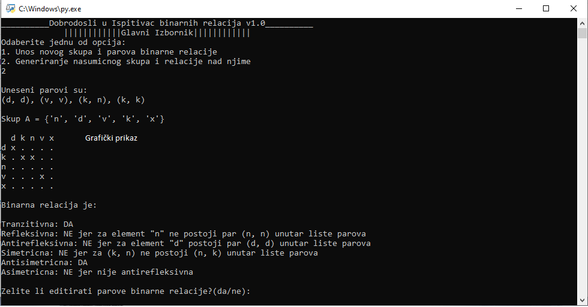

# Grafički prikaz  

Ovom funkcijom omogućili smo prikaz i ispis binarnih relacija tablično u konzolu i datoteku.
 
 
| Algoritam                                                                         |
| --------------------------------------------------------------------------------- |
| 1. Funkcija prima 2 parametra (skupA i listaParova )                              |
| 2. Sortiranje elemenata skupa abecedno |
| 3. Ispis zaglavlja tj. prvog reda tablice sa svim elementima skupa A                                 |
| 4. Ispis sadržaja tablice                   |
| 5. Za svaki element skupa A radi                       |
| 6. Pohrani trenutni element u varijablu **redak** (to će biti početak retka)         |
| 7. U listu **elementiRetka** pohrani sve **druge** elemente parova iz listeParova čiji je **prvi element** jednak trenutnom elementu skupaA     |
| 8. Za svaki element skupaA radi |
| 9. Za svaki element elemenataRetka radi  |
| 10. Ako element skupaA == elementRetka dodaj u varijablu redak znak 'x' | 
| 11. Za elemente koji nisu isti dodaj u varijablu redak znak '.' |
| 12. Nakon prolaska kroz sve elemente Skupa A ispiši redak u konzolu i datoteku
| 13. Prijeđi na slijedeći redak tablice (slijedeći element skupa A) |
  
    
      
 **Programski kod:**       
    
    
```python
#funkcija koja graficki iscrtava elemente binarne relacije
def graficki(listaParova:list,skupA:list):
    with open('Relacije.txt', 'a') as f:

        skupA.sort()
        print()
        print("", file=f)
        print('  ',end='')
        print('  ',end='', file=f)

        #header tablice
        for e in skupA:
            print(e,end=" ")
            print(e,end=" ", file=f)
        print(' ')
        print(' ', file=f)
        #sadrzaj tablice
        for e in skupA:
            redak = e
            elementiRetka = [el[1] for el in listaParova if el[0]==e] 
            for y in skupA:
                jednak = False
                for i in elementiRetka:
                    if i == y: 
                        redak = redak + ' x'
                        jednak = True
                        break
                if not jednak: redak = redak + ' .'
            print(redak)
            print(redak, file=f)
```
**Primjer tabličnog prikaza u konzoli**


 
