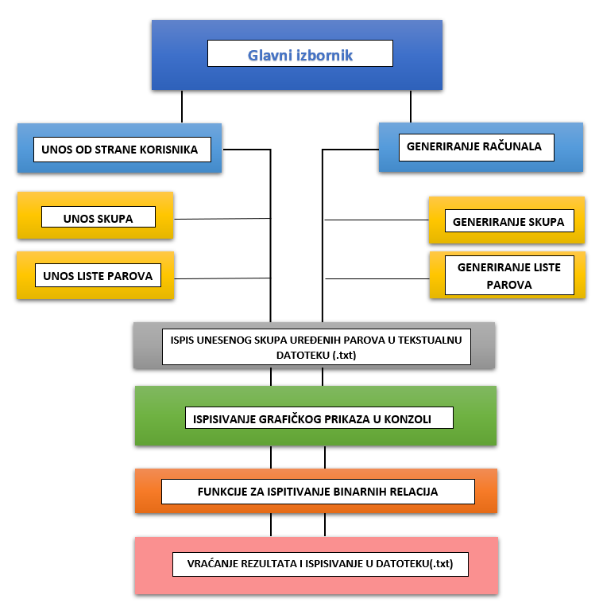

# Korištenje Pythona pri ispitivanju svojstava binarne relacije nad zadanim skupom

## Opći podaci projekta:
**Predmet:** Matematika 1  
**Studenti:** Tin Pritišanac, Neven Davidović, Noel Modrušan  
**Vrsta projekta:** Računalno riješen matematički problem  
**Ime programa:** Ispitivač binarnih relacija v1.0  
**Literatura:** Papić, P., Uvod u teoriju skupova, HMD, 2000.  

_____________________________________________________________________________
### Sažetak

U ovom projektu smo izradili računalni program u programskom jeziku Python koji će na temelju korisnikovog unosa ili generiranog nasumičnog skupa parova binarne relacije  ispitati njena svojstva (refleksivnost, simetričnost, asimetričnost, antisimetričnost, tranzitivnost) te korisniku jasno naznačiti rezultate ovog ispitivanja.  
Cilj izrade ove vrste programa je da se koristi za brzu provjeru rješenja zadataka iz područja binarnih relacija nad skupovima, te brže rješavanje dužih tipova zadataka. Isto tako korisniku želimo prikazati razloge zbog kojih su pojedina svojstva točna ili netočna, kako bi stekao bolje razumijevanje procesa ispitivanja binarnih relacija nad zadanim skupom. 

_____________________________________________________________________________

### Opis programa

Program počinje sa izbornikom koji omogućava korisniku da ili sam izabere skup i uređene parove ili da to program napravi umjesto njega.
Osim izbornika program se sastoji od zasebnih funkcija čija je zadaća ispitati svojstva binarne relacije. Korisniku su dostupne mogućnosti unosa nove liste parova, brisanje postojećih i dodavanje novih parova, nakon čega će se ponovo ispisati odgovarajući rezultat. 
Svaka od funkcija ispituje po jedno svojstvo binarne relacije te vraća tip podatka *bool* glavnoj funkciji iz koje su pozvane.   Ono što prethodi vraćanju rezultata je grafički prikaz odnosa uređenih parova unutar same konzole.  
Nakon provjere nad zadanim skupom i listom parova rezultati se ispisuju u tekstualnu datoteku.  
Korištene su biblioteke Regular expression operations(re), random i time. 

_____________________________________________________________________________
**STRUKTURA PROGRAMA :**  
  
**Glavne funkcije:**
 - [Funkcija za unos podataka](Funkcije/UnosPodataka.md)  
 - [Funkcija za ispitivanje tranzitivnosti binarne relacije](Funkcije/Tranzitivnost.md)    
 - [Funkcija za ispitivanje refleksivnosti binarne relacije](Funkcije/Refleksivnost.md)  
 - [Funkcija za ispitivanje antirefleksivnosti binarne relacije](Funkcije/Antirefleksivnost.md)  
 - [Funkcija za ispitivanje simetričnosti binarne relacije](Funkcije/Simetričnost.md)    
 - [Funkcija za ispitivanje antisimetričnosti binarne relacije](Funkcije/Antisimetričnost.md)
 - [**Funkcija za ispitivanje svojstava binarnih relacija nad skupom**](Funkcije/IspitivanjeRelacija.md)    
 - [**Glavna funkcija**](Funkcije/GlavnaFunkcija.md) 

**Ostale funkcije:**
- [Grafički prikaz uređenih parova unutar tablice](Features/GrafickiPrikaz.md)
- [Nasumično generiranje zadataka](Features/RandomGeneriranje.md)
- [Ispis rezultata u tekstualnu datoteku](Features/IspisRezultata.md)  
- Funkcija za provjeru unosa
  

**Cjelokupan programski kod:**  
- [Ispitivač binarnih relacija v1.0.md (markdown)](Programski_kod.md)
- [Ispitivač binarnih relacija v1.0. py (python)](Projekt.py)
____________________________________________________________________________
### Shema rada programa

_____________________________________________________________________________
## Zaključak

Ovakva vrsta programa uvelike može pomoći pri testiranju svojstava binarnih relacija nad zadanim skupom, ali i kao alat za generiranje zadataka i rješenja.   
Osim rezultata svojim objašnjenjima pomaže razjasniti zašto su određena svojstva prisutna, a  zašto određena nisu.  

___________________________________________________________________________________
<a href="#top">Povratak na vrh</a>

